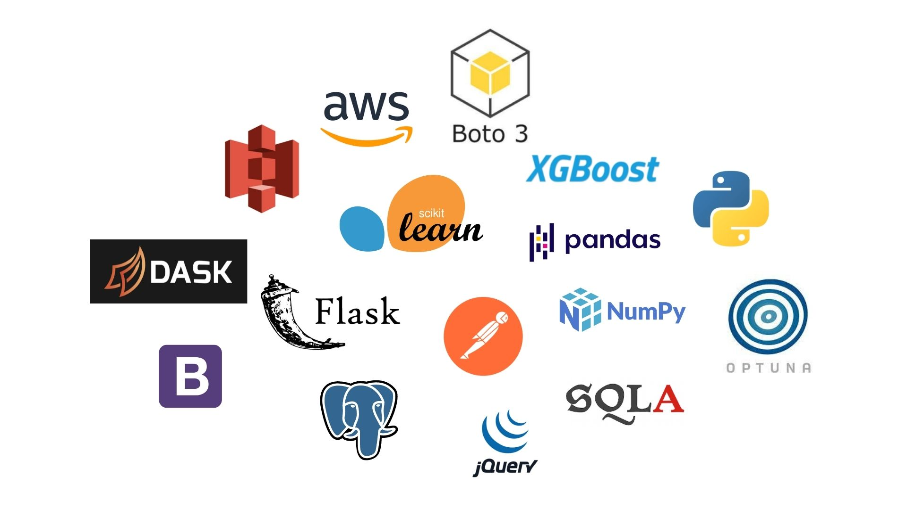
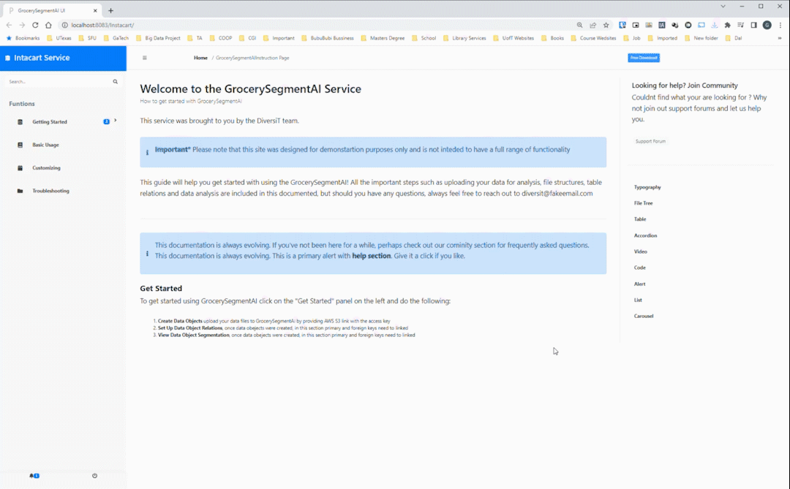
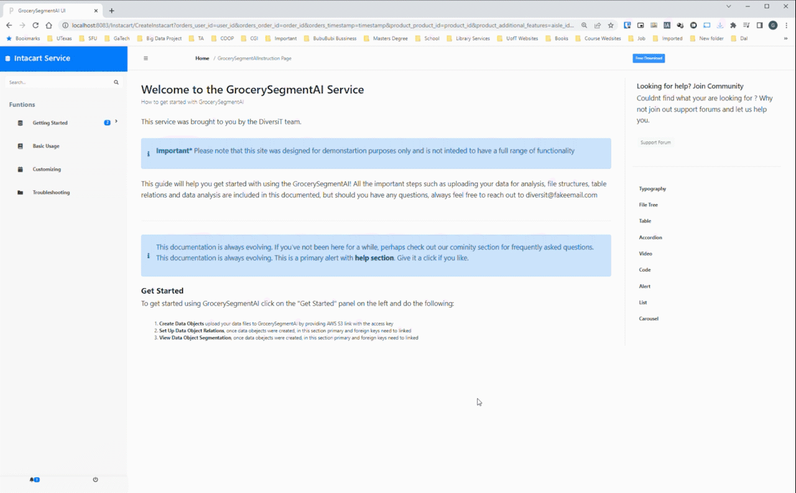
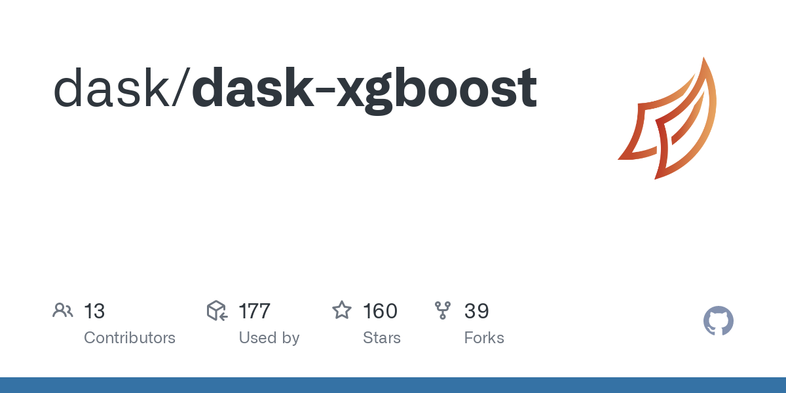
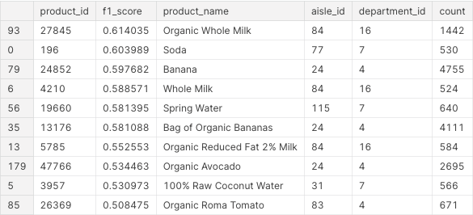
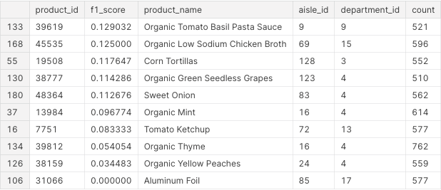

# Grocery Segment AI

GrocerySegmentAI is a platform as a service for grocery businesses. This product provides a way for these businesses to upload customer data and receive accurate predictions on which customers will buy a specific product on their next order. 

## What problem does this solve?

Every business is driven by customers. For a business to be successful, it must know what its customers want now, and what they want in the future. This allows businesses to optimize marketing strategies, improve customer experience, and maximize each customer’s value.

Furthermore, 30% of food in North-American grocery stores is thrown away. By predicting which products will be bought next, we are providing a means of improving inventory management with a data-driven approach.

## Our Solution

GrocerySegmentAI. This product is an end-end solution that is easy to use and requires little technical expertise. A business can simply upload their customer data into an S3 bucket on AWS, wait for their model to train, and thats it! The business can then enter a product_id, and they are given a list of their customers who are likely to buy that product next. 

## Technologies

We used many technologies and packages to build this product. In the following image, we show the main tools used.

## User Interface

The interface created for this product was built with ease of use being a priority. In the first GIF, we can see a user enter their S3 bucket information to initiate the model training. During training, the user can get a status update via the interface. The training time depends on the size of the input data.

In the second GIF, model training has been completed, and a user is now selecting a product id to query. When they submit this form, they receive a CSV file of all the customers that will buy that product on their next order.

## Our Dataset

Due to privacy concerns, there are a very small number of customer datasets available in the public domain. That being said, we built this product using the [Instacart Dataset](https://www.kaggle.com/c/instacart-market-basket-analysis). This dataset is anonymized and contains a sample of over 3 million grocery orders from more than 200,000 Instacart users.

We simplified this dataset by combining features into one column to make it consistent with our format. This modified version of the dataset can be found [here](https://www.kaggle.com/datasets/brendanartley/simplifiedinstacartdata).

## Best Model

Our best performing model was an XGBoost Classifier that achieved an F1-score of 0.39. We used F1-score rather than raw accuracy as about 90% of the predicted labels were 0. This metric gave us a more realistic measure of performance. We also used a subset of the data and a framework called Optuna to find the best hyperparameters for this model.

Other models that we tested included Logistic Regression, Tabnet, LGBM, and K-means clustering.

## Evaluating Predictions

Using cross-validation we were able to get predictions on every user in the dataset and have a set of predictions that mirrored the true model performance in the real world. We found that the model was able to accurately predict some products, and others not so much. In this first image, we have some products on which the model performed well on, and in the second image, we have those where the model did not perform as well. The numerical column is the f1-score of each product. As you can see we were able to predict milk, soda, and bananas very accurately, but we could not predict aluminum foil or organic yellow peaches very well.

  

## Further Improvements

The first thing we would have liked to improve on is evaluating our product. Given the privacy concerns of customer data, there are very few datasets in the public domain. Unfortunately for us, this meant that we were only able to test our model on data from one grocery business. Moreover, we would also test our product in other industries where purchases are frequent such as restaurants but again it may be difficult to find these datasets in the public domain.

We would also want to explore RNN and LSTM based models as they typically perform well on time series data. Given that our orders are in a sequential format, it would be interesting to see if we could incorporate these models into our pipeline.

## Setup Instructions
Due to the complexity of the service, the setup is also complex. We have provided a comprehensive guide below to explain this setup process.

Required Software/Packages
- Make sure that you have and up to date Java JDK installed (>12.0.2)
- Download and install MySQL server, MySQL Workbench, JRE and Eclipse EE Edition
- Run `pip3 install -r requirements.txt` from the repo to install python packages

Import the project
- Open Eclipse
- Select File -> Open Projects
- Click on Directory
- Navigate to this repo and select UI/code/Instacart directory
- Click on Select Folder
- Once the project is selected in the Project Description box click Next

Create the Server
- In Eclipse press File -> New -> Other
- Click on Server dropdown and select Server
- Click on Next
- Click on Apache dropdown, scroll down and select Tomcat v9.0 Server
- Click on Next
- In the Available box you should see Instacart(Instacart-0.0.1-SNAPSHOT)
- Select it and click on Add
- Click Next
- Click Finish

Configure Project
- In the project explorer window right-click on the Instacart project
- Click on Build Path -> Configure Build Path
- In the libraries tab select JRE System Libraries
- Click on Edit
- Select Alternate JRE radio and select your JRE version
- Click on Finish
- In the Java Build Path Menu click on Add External JARs
- Navigate to UI/server/apache-tomcat-9.0.54/lib and select servlet-api.jar
- Click on open
- Then in the Build Path Menu click on Apply and Close

Configure MySQL Database
- Open MySQL Workbench
- Select the connection to your MySQL server
- Click on the Administration tab
- Click on Data Import/Restore
- Select Import from Self-Contained File radio
- Click on the 3 dots button to locate the file
- Navigate to our repo to the UI/db_backup/
- Select GrocerySegmentAI.sql file
- Click open
- Click Start Import
- In the MySQL Workbench in the Navigator window click on the Schemas tab
- Right-click on the empty space in the SCHEMAS window and click on Refresh ALL

Launch the UI
- In the Eclipse right-click on the Instacart project
- Click on Run As -> Run on Server
- Click on the localhost dropdown
- Select Tomcat v9.0
- Click on Next
- Click on Finish

Launch API
- Navigate to the backend/ folder
- Run `python3 segmentation_service.py`